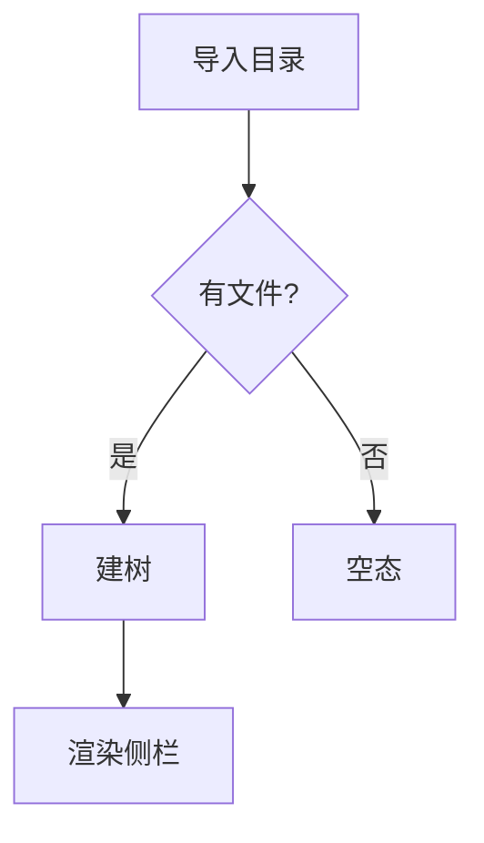
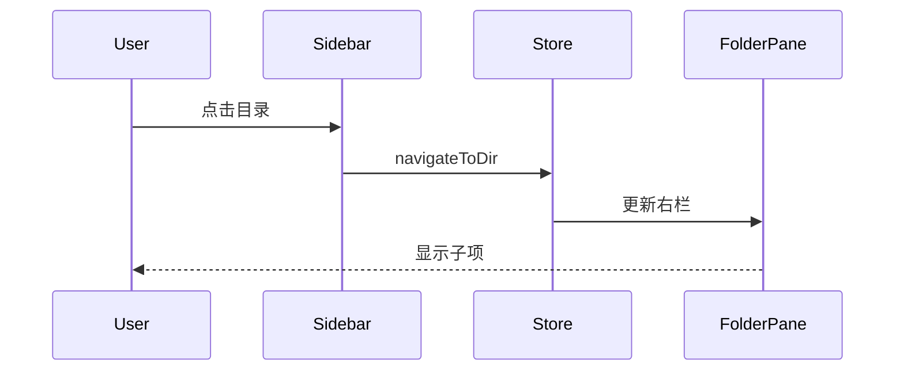

# Mermaid 测试

## 正常流程图

```mermaid
graph TD
  A[导入目录] --> B{有文件?}
  B -->|是| C[建树]
  B -->|否| D[空态]
  C --> E[渲染侧栏]
```

## 时序图

```mermaid
sequenceDiagram
  User->>Sidebar: 点击目录
  Sidebar->>Store: navigateToDir
  Store->>FolderPane: 更新右栏
  FolderPane-->>User: 显示子项
```

## 语法错误（应显示错误兜底，不能白屏）

```mermaid
graph TD
  A[ --> ]]]
```

## 图之后的文字

如果上面两张图出现**高度被截断**（底部被裁掉）或**大量空白**，说明 WebView 高度量测有问题。
